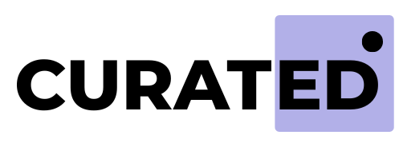

<p align="center">
  <a href="https://curat-ed.vercel.app">
    <picture>
      <source srcset=".github/assets/logo-dark.png" media="(prefers-color-scheme: dark)">
      <source srcset=".github/assets/logo-light.png" media="(prefers-color-scheme: light)">
      
    </picture>
  </a>
</p>

<p align="center"><b>Education Platform for Self-taught Learners</b></p>

<p align="center">
  <a href="https://github.com/IndiecoderMM/curated">
    
  </a>

  <a href="https://github.com/IndieCoderMM/curated/graphs/contributors">
    
  </a>

  <a href="https://github.com/IndieCoderMM/curated/blob/main/LICENSE">
    
  </a>
</p>

## 🌟 Features

### Personalized Learning Playlists

- Create custom playlists of YouTube videos based on what you want to learn.
- Structure your learning path at your own pace and style.

### Progress Tracking

- Keep track of which videos you’ve completed.
- Resume right where you left off, across all your playlists.

### Community Engagement

- Share your playlists or browse those made by others.
- Learn with like-minded people who are on the same path.

### A Focused Learning Environment

- A clean, distraction-free space for studying.
- Simple tools to help you stay organized and on track.

## 🚀 Getting Started

1. Clone the repository:

   ```bash
   git clone https://github.com/IndieCoderMM/curated.git
   cd curated
   ```

2. Install dependencies:

   ```bash
   npm install
   ```

3. Set up environment variables:

   ```bash
   cp .env.example .env
   ```

   Edit the `.env` file with your settings (database URL, API keys, etc.)

4. Start the development server:

   ```bash
   npm run dev
   ```

5. Visit the app at:

   ```
   http://localhost:3000
   ```

## 🤝 Contributing

Want to help improve Curated? Contributions are welcome!

1. Fork this repo
2. Create a branch:

   ```bash
   git checkout -b feature/your-feature-name
   ```

3. Make your changes and commit:

   ```bash
   git commit -m "Add your feature"
   ```

4. Push and open a pull request:

   ```bash
   git push origin feature/your-feature-name
   ```

## 📜 License

Curated is open-source and available under the [MIT License](LICENSE).

## 🙌 Acknowledgments

Curated was originally inspired by this awesome tutorial from Antonio:

- [Building a LMS Platform with Next.js](https://www.youtube.com/watch?v=Big_aFLmekI)

Thanks to the community and developers who inspired me and helped shape this project.
